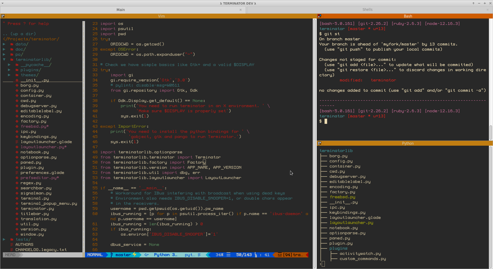
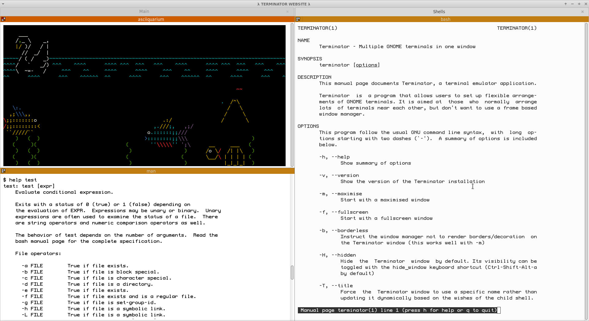
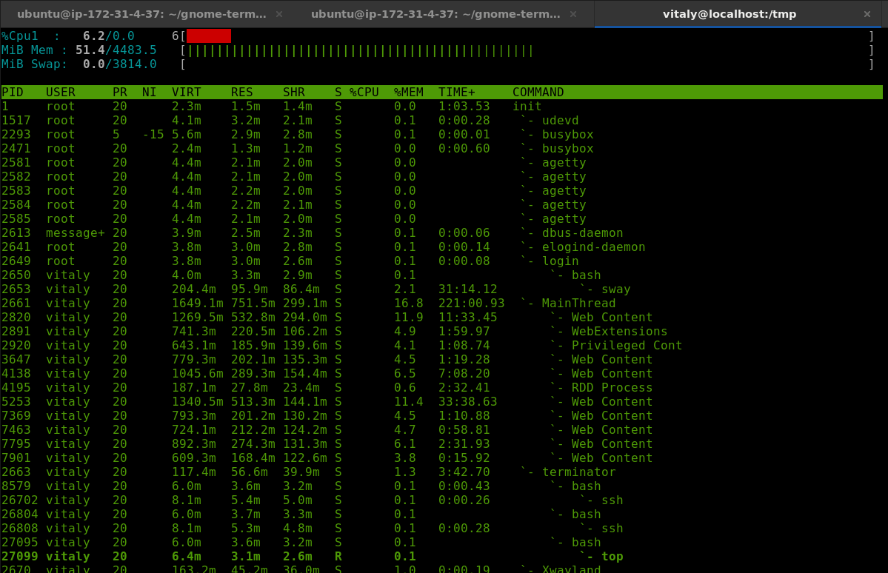

## Overview

### Multiple GNOME terminals in one window!

Terminator was originally developed by Chris Jones in 2007 as a simple, 300-ish line python script.  Since then, it has become The Robot Future of Terminals.  Originally inspired by projects like quadkonsole and gnome-multi-term and more recently by projects like Iterm2, and Tilix, It lets you combine and recombine terminals to suit the style you like.  If you live at the command-line, or are logged into 10 different remote machines at once, you should definitely try out Terminator.

## [Screenshots](#screenshots)

For more information, take a look at the [about page](/about).

